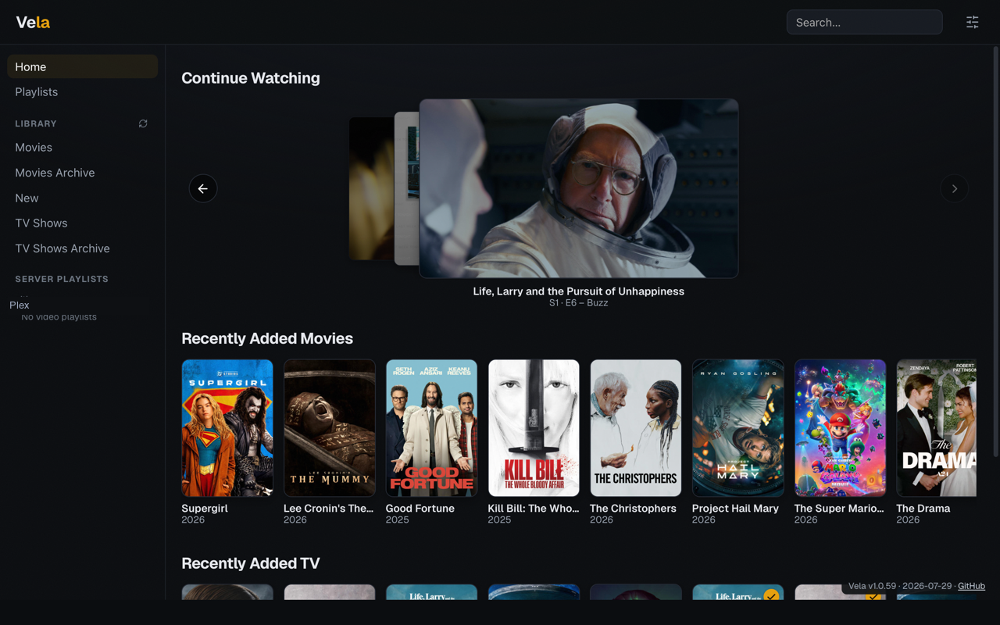
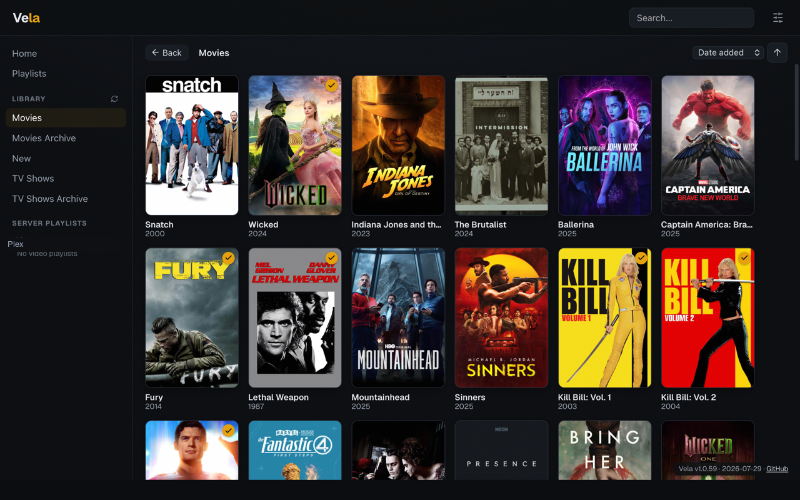
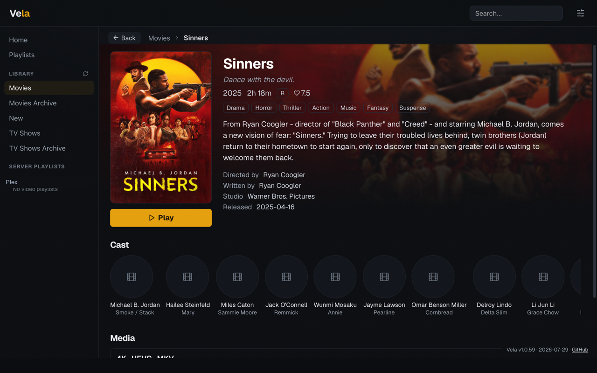
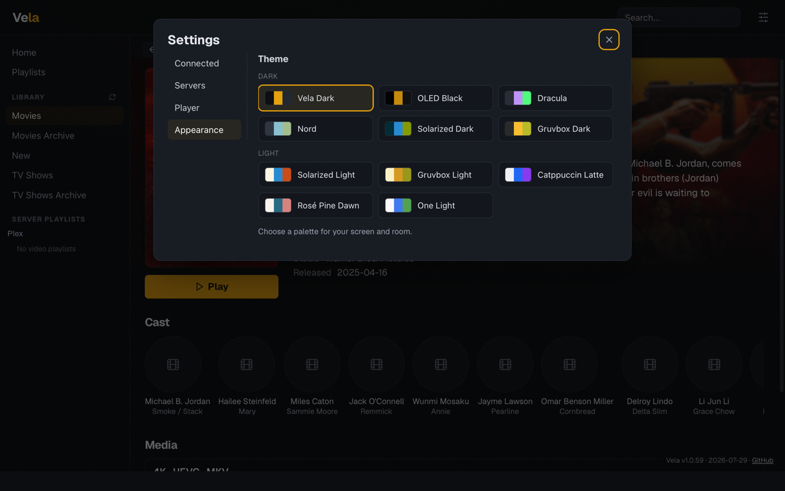

  

<h1 align="center">Vela</h1>

  <strong>Your media servers, one HDR-first desktop client.</strong> 
  Plex · Jellyfin · experimental Emby &nbsp;—&nbsp; Linux · macOS · Windows

  
  

  

Vela gathers your Plex, Jellyfin, and Emby servers into one polished desktop
app, and hands video playback to [mpv](https://mpv.io/) — the player
enthusiasts trust for color-accurate, HDR-first output. Browse everything in a
beautiful native interface, then watch in a real video player instead of a
webview.

**[Download the latest release](https://github.com/roethlar/vela/releases/latest)**
for macOS, Windows, Linux, or Arch.

## Why you'll like it

- **HDR done right.** Vela launches the system mpv with `gpu-next` and
  platform-aware defaults for HDR passthrough on Linux, macOS, and Windows —
  your TV or monitor gets the signal it was meant to see.
- **Everything in one place.** Search or browse each server on its own, or use
  the deduplicated All view to see your whole collection at once. When the same
  title lives on more than one server, Vela picks the best copy for your screen
  — or asks, if you prefer.
- **Pick up where you left off.** A media-first Continue Watching cover-flow
  combines server resume data with Vela's own recent plays. Resume, restart,
  remove, or mark watched from the item menu.
- **Marathon-friendly.** Build your own playlists across servers, browse server
  playlists without touching them, and let Vela roll into the next episode
  after a clean finish.
- **A real library interface.** Infinite scrolling, persistent per-library
  sorting, search, show/season/episode navigation, rich details, clickable
  people, library scans, and manual refresh are built in.
- **Made for the couch.** Eleven palettes include a literal-black OLED theme;
  subtle motion, art reveal, and optional black-bar cropping keep the
  interface out of the video's way.

  
  
  

## Getting started

1. **Install mpv 0.38 or newer** if you don't have it. mpv is deliberately not
   bundled, so it stays independently updateable. Vela detects common install
   locations, can offer a package-manager install on first run, and accepts a
   custom executable under Settings → Player.
2. **Download Vela** from
   [GitHub Releases](https://github.com/roethlar/vela/releases/latest) and
   install it. macOS and Windows releases are signed — Developer ID signed and
   notarized on macOS, Authenticode signed on Windows — so Gatekeeper and
   SmartScreen accept them without an approval prompt. Linux and Arch packages
   are unsigned. `SHA256SUMS` is attached to every release.
3. **Connect a server.** Open Settings → Servers. Link Plex with its device
   code, or add Jellyfin/Emby with a username and password or an API key.
4. **Pick a library and play.** Movies play from their detail view; shows
   drill through seasons and episodes; Continue Watching cards play directly.

For HDR playback you need an HDR-capable display, OS session, and GPU path: on
Linux a Wayland compositor with HDR/color-management support such as KDE
Plasma 6 or a current Hyprland (X11 is not an HDR path); on macOS an
EDR-capable display; on Windows 10/11, HDR enabled in system settings.

## Server support

| Server | Status | Current scope |
| --- | --- | --- |
| **Plex** | Primary | Multiple accounts/servers (one linked source per machine), Device-PIN sign-in, libraries, search, rich details, watch state, Continue Watching, scans, and server playlists. |
| **Jellyfin** | Supported | Multiple connections, libraries, search, playback/check-ins, watch state, and server playlists. Real-server smoke tested; some detail views are sparser than Plex. |
| **Emby** | Experimental | Uses the shared Jellyfin-family client and is covered where the APIs overlap, but has not yet been exercised against a real Emby server. |

Plex playback requires a reachable direct HTTPS server connection. Plex Relay
is deliberately not used by default for HDR playback, so remote playback may
require Plex Remote Access or joining the server's network.

## Going deeper

Vela defaults to streaming files untouched ("Original" quality) because it is
the only setting that keeps HDR — server-side conversion is available per
setting or per play when you need it. Multi-server source policies, playback
quality tiers, intro/credits skipping, black-bar cropping, and custom mpv
options are covered in [docs/usage.md](docs/usage.md).

## Your data stays yours

Vela stores its settings, connections, and playlists as plain local files in
the platform configuration directory, with owner-only permissions on Unix and
automatic rollback copies if a file is ever damaged. It sends no analytics and
never proxies your credentials through a third party. Details, including
exactly where credentials can appear locally, are in
[docs/usage.md](docs/usage.md#configuration-recovery-and-privacy).

## Known limitations

- Each Plex link selects one server machine. Additional Plex, Jellyfin, and
  Emby connections can be added as separate sources.
- Emby remains experimental until it receives live-server integration testing.
- HDR fidelity ultimately depends on mpv, its GPU backend, the display, and the
  operating system's color-management path.

Known issues and follow-up work are tracked in [ISSUES.md](ISSUES.md).

## Support the project

Vela is free and open source. If it earns a spot on your desktop, you can
support development on [Ko-fi](https://ko-fi.com/michaelcoelho) or
[GitHub Sponsors](https://github.com/sponsors/roethlar).

## Development

Build instructions, the verification set, end-to-end tests, and architecture
notes live in [docs/development.md](docs/development.md).

## License

Vela is licensed under the [MIT License](LICENSE). The bundled upstream
`autocrop.lua` mpv script is GPL-2.0-or-later; its license and provenance are
included under
[`src-tauri/resources/mpv-scripts/`](src-tauri/resources/mpv-scripts/PROVENANCE.md).
