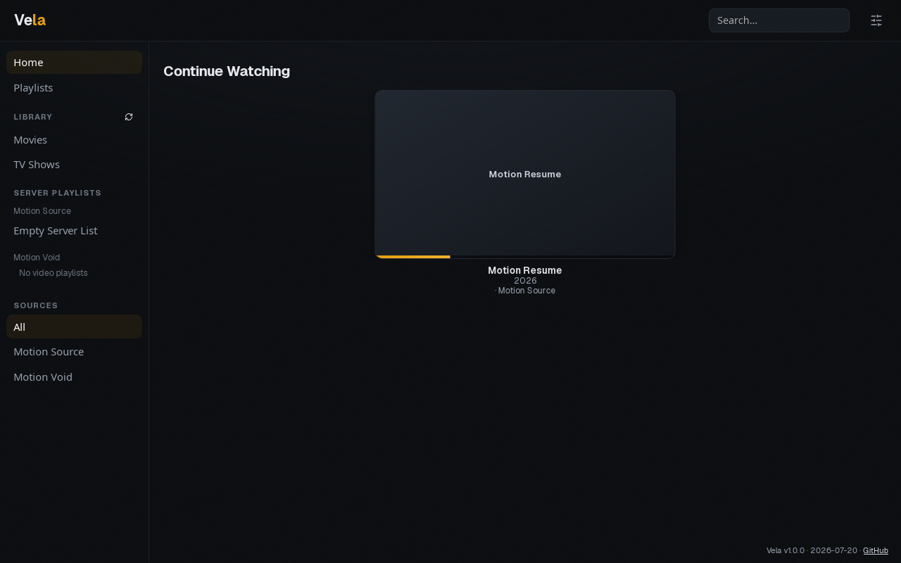

<p align="center">
  
</p>

<h1 align="center">Vela</h1>

<p align="center">
  <strong>Your media servers, one HDR-first desktop client.</strong><br>
  Plex · Jellyfin · experimental Emby &nbsp;—&nbsp; Linux · macOS · Windows
</p>

Vela brings server libraries into a focused native desktop interface and hands
video playback to [mpv](https://mpv.io/) in its own window. That separation is
the point: the library gets a polished app UI, while video keeps mpv's mature
codec, GPU, tone-mapping, and HDR output path instead of being constrained by a
webview player.

Vela 1.0 is available from [GitHub Releases](https://github.com/roethlar/vela/releases/latest).
Plex is the primary and most deeply exercised backend, Jellyfin has been tested
against a real server, and Emby currently ships as an experimental sibling of
the Jellyfin integration.



## Why Vela

- **HDR-first playback.** Vela launches the system mpv with `gpu-next` and
  platform-aware output defaults for HDR passthrough on Linux, macOS, and
  Windows.
- **One place to browse.** Search or browse individual sources, or use the
  deduplicated All view to see titles across servers. When copies exist on more
  than one server, Vela can choose by quality, display compatibility, or source
  locality; ask each time; or honor a title's manual **Play Version** choice.
- **Continue where you left off.** A media-first Continue Watching cover-flow
  combines server resume data with Vela's recent plays. Resume, restart, remove,
  or mark watched from the item menu.
- **Video-native sequences.** Create editable Vela playlists across sources,
  browse server playlists without modifying them, and optionally continue into
  the next episode or rendered Continue Watching item after a clean finish.
- **A real library interface.** Infinite scrolling, persistent per-library
  sorting, search, show/season/episode navigation, rich Plex details, clickable
  people, library scans, and manual refresh are built in.
- **Designed for the room.** Eleven palettes include a literal-black OLED theme;
  subtle motion, art reveal, and optional mpv autocrop keep the interface out of
  the video's way.

## Server support

| Server | Status | Current scope |
| --- | --- | --- |
| **Plex** | Primary | Multiple accounts/servers (one linked source per machine), Device-PIN sign-in, libraries, search, rich details, watch state, Continue Watching, scans, and server playlists. |
| **Jellyfin** | Supported | Multiple connections, libraries, search, playback/check-ins, watch state, and server playlists. Real-server smoke tested; some detail views are sparser than Plex. |
| **Emby** | Experimental | Uses the shared Jellyfin-family client and is covered where the APIs overlap, but has not yet been exercised against a real Emby server. |

Plex playback requires a reachable direct HTTPS server connection. Plex Relay
is deliberately not used by default for HDR playback, so remote playback may
require Plex Remote Access or joining the server's network.

## Install and run

Download the current macOS, Windows, Linux, or Arch package from
[GitHub Releases](https://github.com/roethlar/vela/releases/latest). Release
binaries are unsigned: macOS Gatekeeper and Windows SmartScreen may require an
explicit approval. `SHA256SUMS` is attached to every release.

### Runtime requirements

- **mpv 0.38 or newer is recommended.** mpv is not bundled, so it remains
  independently updateable. Vela detects common install locations, can offer a
  package-manager install on first run, and accepts a custom executable under
  Settings → Player. Vela currently verifies that mpv runs, not its exact
  version.
- **HDR playback needs an HDR-capable display, OS session, and GPU path.** On
  Linux, use a Wayland compositor with HDR/color-management support such as KDE
  Plasma 6 or a current Hyprland; X11 is not an HDR path. On macOS, use an
  EDR-capable display. On Windows 10/11, enable HDR in system settings.
### Build an installer

Building needs Rust, Node.js, and
[Tauri's platform prerequisites](https://tauri.app/start/prerequisites/).
Debian-family Linux needs WebKitGTK 4.1, libsoup 3, GTK 3, librsvg,
Ayatana AppIndicator, and `patchelf`; macOS needs Xcode Command Line Tools;
Windows needs WebView2, MSVC Build Tools, and PowerShell 7 for the wrapper
below. The current Arch PKGBUILD targets x86_64.

Install the Node and npm versions pinned by `.node-version` and `package.json`,
then run:

```bash
git clone https://github.com/roethlar/vela.git
cd vela
node scripts/check-js-toolchain.mjs
npm ci
./scripts/build.sh
```

On Windows, use the equivalent PowerShell wrapper:

```powershell
pwsh scripts/build.ps1
```

The wrapper builds the native package for its host and prints the artifact
location. The macOS default is a universal Apple Silicon + Intel DMG;
Debian-family Linux defaults to an AppImage; Arch builds a pacman package; and
Windows builds an NSIS installer. Linux `.deb` and `.rpm` bundles can be forced
with:

```bash
./scripts/build.sh --bundles deb,rpm
```

### First run

1. Open Settings → Servers.
2. Link Plex with its device code, or add Jellyfin/Emby with a username and
   password or API key.
3. Choose a library and play. With multiple connections, the sidebar also lets
   you choose All or an individual source.

Movies play from their detail view. Shows drill through seasons and episodes.
Continue Watching cards play directly; their context menu exposes resume and
play-from-beginning actions.

## Player and HDR notes

Vela launches mpv as a separate process and tracks it through mpv's JSON IPC.
Progress and completion are reported back through Plex timelines or
Jellyfin/Emby playback check-ins, allowing server-side resume across sessions.

When the same title exists on multiple connected servers, Settings → Player
offers four source policies:

- **Prefer Best** ranks resolution first, then HDR within that resolution, then
  bitrate. A 4K SDR copy therefore beats a 1080p HDR copy.
- **Prefer Compatible** favors versions at or below the playback display's
  detected resolution and matching its current HDR state. Resolution and HDR
  can be overridden independently when native detection is unavailable or
  wrong.
- **Prefer Fastest Source** chooses this machine, then the local network, then
  the internet, using Prefer Best to break ties within a locality tier.
- **Ask Every Time** prompts for every standalone duplicate play. During one
  Vela playlist or TV-continuation run, the first choice is reused until that
  server lacks an item, when Vela asks again. Server-owned playlists never move
  to another server: if their owner goes offline, playback stops.

**Play Version** in a title's menu is a persistent per-title server override in
the three automatic modes. In Ask Every Time it applies only to that play and
is not saved. Resume position remains specific to the copy being played, while
manual watched/unwatched changes and natural completion update every currently
connected copy of the title. Updates are best-effort and are not queued for an
offline server.

By default Vela uses a predictable `--no-config` mpv profile. Settings → Player
can opt into your own `mpv.conf` or append custom mpv options; those settings can
also override Vela's HDR defaults or prevent playback, so change them
deliberately.

Black-bar cropping is Off by default. Manual mode runs on `Shift+C`; Automatic
mode attempts every video. Automatic crop detection can be unreliable with HDR
on some GPU/Wayland combinations and may occasionally hang mpv, so Manual is
the safer option when that occurs.

On NVIDIA + Wayland, Vela disables WebKitGTK's DMABUF renderer at startup to
avoid a known webview crash. This affects the library UI renderer, not mpv's
video output, and has no effect on macOS or Windows.

## Configuration and privacy

Vela stores `config.json` and `playlists.json` in the platform configuration
directory:

- Linux: `~/.config/vela/`
- macOS: `~/Library/Application Support/com.vela.vela/`
- Windows: `%APPDATA%\vela\vela\config\`

Back up both files to preserve connected servers, preferences, recents, and
Vela playlists. On Unix, Vela writes its configuration with owner-only
permissions.

Plex stream credentials are sent as an HTTP header through an owner-only mpv
include file rather than being placed in the media URL or process arguments.
Jellyfin/Emby stream URLs and server image URLs can contain access tokens, so
those tokens remain visible locally to the Vela webview or mpv process. Vela
does not send analytics or proxy credentials through a third party.

Configs written by older Vela builds may still contain removed local-folder,
SMB, or SSH fields, including old SMB credentials. Current builds preserve but
ignore those fields so rollback remains possible. Removing them permanently is
a manual edit of `config.json`.

## Known limitations

- Each Plex link selects one server machine. Additional Plex, Jellyfin, and Emby
  connections can be added as separate sources.
- Emby remains experimental until it receives live-server integration testing.
- HDR fidelity ultimately depends on mpv, its GPU backend, the display, and the
  operating system's color-management path.

Known issues and follow-up work are tracked in
[ISSUES.md](ISSUES.md).

## Development

Run the app in development mode after installing the pinned toolchain and
dependencies:

```bash
npm run tauri dev
```

The core verification set is:

```bash
node scripts/check-js-toolchain.mjs
npm ci
npm audit
npm run check
npm run build

cd src-tauri
cargo +1.89.0 check --locked
cargo +stable check --locked
cargo +stable clippy --all-targets --locked -- -D warnings
cargo +stable test --locked
cargo audit --file Cargo.lock
cd ..
```

Linux end-to-end tests drive the real debug app, WebKitGTK, and mpv on a private
Xvfb display with a throwaway Vela config:

```bash
npm run e2e                    # build and run every scenario
npm run e2e -- --skip-build    # reuse the current debug binary
npm run e2e -- playback        # run one scenario by name
```

The E2E venue needs `tauri-driver`, Xvfb, ffmpeg, mpv, bsdtar, and curl. The
first run downloads the pinned WebKitWebDriver described in
[tests/e2e/README.md](tests/e2e/README.md); artifacts land under
`tests/e2e/artifacts/`.

## Architecture

- **Desktop shell:** Tauri 2 with a static SvelteKit/Svelte 5 frontend in
  `src/` and a Rust backend in `src-tauri/`.
- **Sources:** Plex and the shared Jellyfin/Emby client implement a common
  `MediaSource` interface behind a source registry. Item keys are namespaced by
  source, allowing unified browsing and cross-source playlists.
- **Playback:** mpv runs out of process. Vela owns launch configuration,
  stream authentication (including credential-safe Plex headers), JSON IPC,
  progress tracking, and sequence handoff; mpv owns decoding and video output.
- **Persistence:** defensive, atomic JSON stores keep application config and
  playlists separate, with cross-process locking and fail-closed parsing.

## License

Vela is licensed under the [MIT License](LICENSE). The bundled upstream
`autocrop.lua` mpv script is GPL-2.0-or-later; its license and provenance are
included under
[`src-tauri/resources/mpv-scripts/`](src-tauri/resources/mpv-scripts/PROVENANCE.md).
